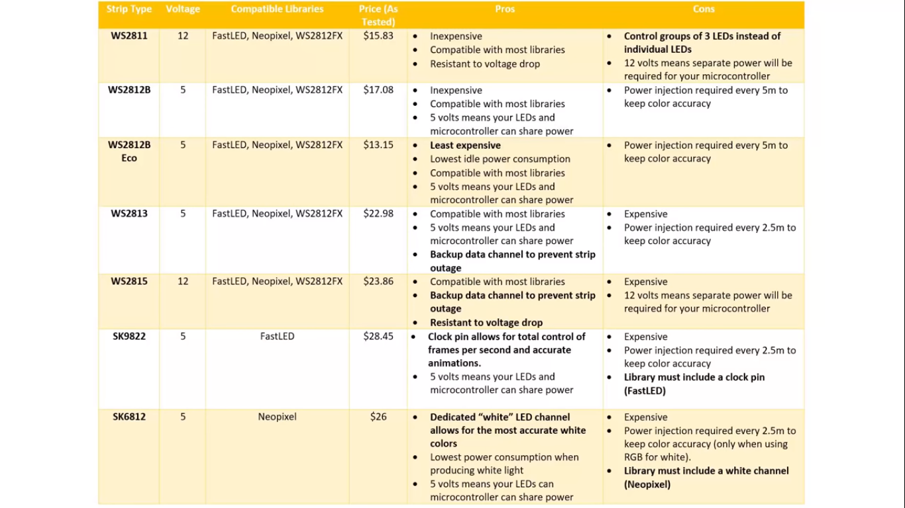

[](http://enesdemirag.mit-license.org)

# pixel-project
ESP32 Controlled LED Matrix

## Requirements

- PlatformIO

## Install

* Clone the project

```
git clone https://github.com/enesdemirag/pixel-project.git
cd pixel-project/
git submodule update --init --recursive
```

* Connect your ESP32 via USB
* ``` platformio run --target upload```

## Usage

Connect to **"Pixel-Project"** bluetooth device using a Bluetooth Serial Terminal App like [this](https://play.google.com/store/apps/details?id=de.kai_morich.serial_bluetooth_terminal&hl=en) and send commands.

|Command|Description|
|:----:|:----:|
|1|Blink|
|2|Go Crazy|
|3|Fire|
|r|Red|
|g|Green|
|b|Blue|
|0|Clear|

## Examples


## References

#### Github Repos and Libraries
- [ESP-Tool](​https://github.com/espressif/esptool)
- [NeoMatrix Library](​https://github.com/adafruit/Adafruit_NeoMatrix)
- [FastLED Library](https://github.com/FastLED/FastLED)
- [ESP32 BLE Library](https://github.com/nkolban/ESP32_BLE_Arduino)

#### DIY Projects
- [Pixelix](https://github.com/BlueAndi/esp-rgb-led-matrix)
- [WS2812 8x8 64 LED Matrix Arduino Examples](http://arduinolearning.com/code/ws2812-8x8-64-led-matrix-arduino-examples.php)
- Bluetooth Classic [​ESP32 Bluetooth Classic with Arduino IDE](https://randomnerdtutorials.com/esp32-bluetooth-classic-arduino-ide/)
- Bluetooth Low Energy [​ESP32 Bluetooth Low Energy (BLE)](https://randomnerdtutorials.com/esp32-bluetooth-low-energy-ble-arduino-ide/)

#### Example Codes
- [ESP32 and WS2812 8x8 LED Matrix](https://hackaday.io/project/25602-esp32-and-ws2812-8x8-led-matrix)
- [SmartMatrix Library ESP32 Port](https://hackaday.io/project/148066-smartmatrix-library-esp32-port)
- PlatformIO Examples [​PlatformIO arduino-esp32 Examples](https://docs.platformio.org/en/latest/platforms/espressif32.html?utm_source=github&utm_medium=arduino-esp32#examples)

#### Datasheets and APIs
- ESP-32 [​ESP32-WROOM-32​](https://www.espressif.com/sites/default/files/documentation/esp32-wroom-32_datasheet_en.pdf) and Company [​Overview](https://www.espressif.com/en/products/hardware/esp-wroom-32/overview)
- [​WS2812B](https://cdn-shop.adafruit.com/datasheets/WS2812B.pdf)
- Dotstar [​Adafruit DotStar LEDs](https://cdn-learn.adafruit.com/downloads/pdf/adafruit-dotstar-leds.pdf)
- [​Bluetooth API](https://docs.espressif.com/projects/esp-idf/en/latest/api-reference/bluetooth/)

#### Products
- ESP32 ​https://www.digikey.com/short/zt2vhj
- Prototype Panel ​Ws2812b 16x16 Rgb Led Esnek Pcb 256 Pixel Led

#### Other
- [Website](​http://esp32.net/)
- TR Development Board [​ESP32 WiFi + Bluetooth Dual-Mode Geliştirme Kartı](https://www.robotistan.com/esp32-esp-32s-wifi-bluetooth-dual-mode-gelistirme-karti)
- Bluetooth Command Application [​Serial Bluetooth Terminal](https://play.google.com/store/apps/details?id=de.kai_morich.serial_bluetooth_terminal&hl=en)

## Figures

* Bluetooth vs. Bluetooth Low Energy (BLE)


* ESP WROOM 32 Pinout


* LED Types and Features


* LED Power Consumptions
